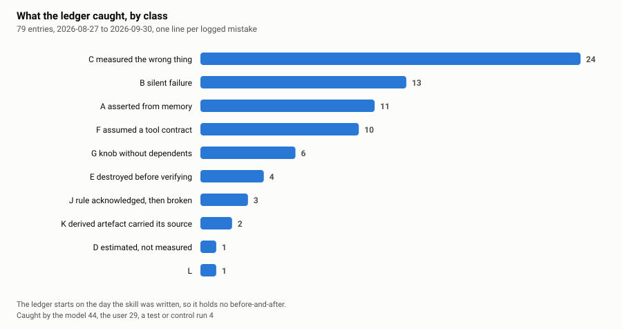

# oops-i-did-it-again

A Claude Code skill and four hooks that turn an agent's mistakes into machinery instead of
into promises.

> **v2, 2026-10-01.** A second month of the same ledger: 79 entries, up from 43. Seven new
> command rules, four new file checks, a new hook that asks absence claims to name their
> search, and five repairs to v1 found by replaying v1 against a month of new history. The
> block rate on real work fell from 1.62% to 0.53% while every incident still fires. What
> changed and why: [v2 in one page](#v2-in-one-page).

The whole thing comes out of one measurement. An audit of 73 session handoffs from a
long-running project asked a single question: which failure classes stopped recurring?

> **Failure classes that were turned into machinery stopped happening. Failure classes that
> were only written down as rules did not.**

The top rule in that project's instruction file was broken the same night it was cited, and
another within 24 hours of being written. A wrapper that removed hand-rolled ssh quoting
erased its entire error class and it never came back.

So this is not a prompt about being careful. It is the loop that runs after an error, plus
the guards that loop produced.

## What is in here

| path | what it is |
|---|---|
| `LESSONS.md` | **the part worth reading even if you install nothing.** Every generalisable lesson from 79 logged mistakes |
| `skills/oops-i-did-it-again/SKILL.md` | the skill: stop, record, classify, mechanise, count recurrences |
| `hooks/bash-guard.py` | PreToolUse guard on Bash. 21 rules, each carrying the incident that created it |
| `hooks/file-guard.py` | PreToolUse guard on Write/Edit. ShellCheck, literal secrets, unproven vendor claims in notes, your banned words, probe scripts that can lie, writes to other users' files, cron timezones |
| `hooks/style-guard.py` | Stop hook. Checks the finished reply against your own writing rules, before the user reads it |
| `hooks/claim-guard.py` | Stop hook. An absence claim ("linked from nowhere", "no importer exists") or a decay count must name the search behind it |
| `hooks/replay.py` | replays a guard against your real command history, so you learn its false-positive rate before wiring it |
| `hooks/guard.py` | the same rules behind a plain CLI, for harnesses that are not Claude Code |
| `install.sh` | wires it up: runs the tests first, backs up `settings.json`, idempotent, `--dry-run` and `--uninstall` |
| `tests/` | 141 cases across six suites, including fail-open, loop-brake and installer tests. `bash tests/run-all.sh` |
| `ledger/LEDGER-TEMPLATE.md` | the append-only error ledger, empty, with one worked example |
| `analysis/` | the impact measurement: `measure.py` scores your own transcripts, `heeded.py` checks whether a warning changed the next command, `gen_charts.py` draws them, `ledger_stats.py` counts your ledger without quoting it |
| `AGENTS.md` | install and extension instructions written for an agent doing this on someone's behalf |
| `PORTING.md` | the wire contract, a mapping table, and an invitation to fork this onto other harnesses |

## Start here

`LESSONS.md` is the distillation of a real error ledger: 79 entries, classified. The
distribution is the surprising part, and a second month did not change it. The largest class
by far is not a broken tool or a hallucinated fact. It is **a working tool, a real number,
and the wrong question**: 24 of 79, 13 of the first 43. Silent failures are 13, asserted
from memory 11, assumed tool contracts 10.



## Did it work

⛔ **v2 note first: the inputs of the chart below no longer exist.** Claude Code deletes
transcripts after 30 days by default, and every transcript from before the guards were
installed is gone. The v1 numbers below are kept exactly as measured on 2026-09-03, and
`analysis/data.json` is frozen with them, but they can no longer be recomputed by anyone,
including us. If you publish a number, archive its inputs the same day (or raise
`cleanupPeriodDays`). The v2 measurements further down use only what still exists.

`analysis/measure.py` scores every Bash command in this machine's Claude Code transcripts
against the current rule set: **9,426 commands over 28 days**, both periods scored
by the same rules. The metric is how often an issued command carried a shape a guard
objects to, per 100 commands.

**9.15 per 100 before, 4.29 after.** The daily swing narrows from 0-23 to 2-7.


⛔ **These numbers replaced an earlier 9.97 -> 7.41, and the reason matters more than the
numbers.** A heredoc written into a file is content, not commands, but the scorer was
reading the body anyway. A handoff quoting `systemctl is-active a b c` was being counted
as though that command had been run. Stripping those bodies is the whole of the change:

| method | before | after | drop |
|---|---|---|---|
| as first published | 9.87 | 7.00 | 29.1% |
| wider meta filter only | 9.87 | 6.98 | 29.3% |
| heredoc bodies stripped only | 9.15 | 4.31 | 52.9% |
| both, as published now | 9.15 | 4.29 | 53.1% |

Two things follow, and neither flatters the result. The measured improvement roughly
doubled because of a scorer bug, not because anything got better. And the fix moves the
*after* period far more than the *before* one, which means the later period contains much
more written documentation; part of what the original chart called improvement was really
us writing more handoffs. A metric that counts prose as commands rewards writing prose.

Per rule, split on each rule's own start date, since a rule cannot have changed a command
written before it existed:


Reading it:

- The rule that BLOCKS is among the steepest falls: `cuda_without_gpus`, down 85%.
- 7 rules fell, 3 rose: `delete_before_verify` up 19%, `guessed_unit_candidates` up 45%, `git_safety` up 469%.
  Task mix, warning fatigue and a rule that is simply too broad all fit that data, and this
  measurement cannot tell them apart. `git_safety` moves on single figures, so its percentage
  is noise, not a finding.
- It counts command shapes, not errors avoided. Most rules warn instead of blocking.
- Six days of "after", one operator, one machine, an uncontrolled workload.
- ⛔ The scorer was wrong once already, and the correction halved the headline. Treat any
  version of this chart as provisional until someone reruns it on their own transcripts.

The better measurement, for a later version: the hook's warning text lands in the
transcript, so pairing each warning with the next command in that session would show how
often it was rewritten.

```bash
python3 analysis/measure.py > analysis/data.json      # your transcripts, your numbers
python3 analysis/gen_charts.py
```

### v2: what a month of new history shows

Three measurements, all from transcripts that still exist (2026-08-31 to 2026-09-30, about
8,500 Bash commands), all reproducible with the scripts named.

**1. Replaying v1 found five of its own bugs** (`hooks/replay.py`, now counted per rule).
v1's replay grouped findings by the first words of the message, and messages carry numbers,
so one rule was scattered over many rows and its real rate never showed. Counted per rule,
one rule produced 124 of 138 blocks, and 82 of those 124 were false: it read a timeout from
a *later* command on the same line. The same mistake, a regex span crossing `;` or `&&`,
made the secret rule deny `head -3 app.log; cut -d= -f1 .env`. Against 16 control cases the
unrepaired guard failed 8, including two things it should have caught and did not: an
`echo '{}' > ~/.claude/settings.json` overwrite, and an `rm -rf /` after an unterminated
heredoc. Every repair is now pinned by cases in `tests/test_rules.py` that fail on v1.

Measured with the guard as deployed on the machine the rules were written for, same
transcripts each time:

| | before repairs | after repairs | plus `STRIP_INTERPRETER_HEREDOCS` |
|---|---|---|---|
| commands | 8,505 | 8,513 | 8,516 |
| any BLOCK | 1.62% | 0.53% | 0.49% |
| any WARN | 8.6% | 8.5% | 8.3% |
| incident control cases caught | 7 of 9 | 9 of 9 | 9 of 9 |

**2. Per-rule, inside the window** (`analysis/data-v2.json`). Rules born in September have
a before and an after that both still exist:

| rule | born | per 100 commands before | after |
|---|---|---|---|
| `r_port_start_unchecked` | 09-11 | 0.47 | 0.03 |
| `r_runner_timeout_shorter` | 09-11 | 4.60 | 2.30 |
| `r_arbitrary_row_from_listing` | 09-02 | 0.59 | 0.15 |
| `r_guessed_unit_candidates` | 09-02 | 0.35 | 0.65 |
| `r_push_over_state_file` | 09-12 | 0.00 | 0.77 |

Two fell hard, one rose, and the one that rose did so because the work shifted to pushing
config files around. One operator, uncontrolled workload: shapes, not errors avoided.

**3. Did a warning change the next command?** (`analysis/heeded.py`, the measurement v1
named as future work.) The hook's verdict lands in the transcript, so each warning can be
paired with the next command in the same session. Of 524 warnings actually shown, 153 (29%)
would not be raised by today's rules: that is the noise the repairs removed. For the rest,
the next command was **unrelated in 84% of cases** (of 401 rule attributions). Where a close
variant did follow, 35 of 65 (54%) dropped the warned shape. A warning is mostly read and moved past. That is the
strongest argument in this repo for keeping WARNs rare and specific, and for BLOCK being
reserved for traps that are never legitimate.

## Install

Needs Python 3.7 or newer (it uses `subprocess.run(capture_output=...)`), bash, and Claude
Code. ShellCheck is optional and only used by `file-guard.py`. Developed on Linux; the hooks
themselves are pure Python and portable, `install.sh` and the shell tests assume a POSIX
shell.

```bash
git clone <this repo> ~/.claude/oops && cd ~/.claude/oops
bash tests/run-all.sh      # expect: ALL SUITES PASS, 141 cases, 0 failures
./install.sh --dry-run     # shows the settings.json it would write, changes nothing
./install.sh
```

`install.sh` runs the suites first and refuses to install if any fail, copies the skill,
backs up `settings.json` before merging, and writes absolute paths. Rerun it after a `git
pull`: it is idempotent. `./install.sh --uninstall` removes only what it added, and
`--project` installs into `./.claude` instead of your home directory.

To wire it by hand instead, merge `settings.example.json` yourself and replace the
placeholder with your clone's absolute path. Do not use `~` in a hook command: whether it
expands depends on whether your build runs the command through a shell, and on the
platform. `${CLAUDE_PROJECT_DIR}` is the supported placeholder for project-scoped installs.

Before you trust the guards on your own machine, run them against your own history:

```bash
python3 ~/.claude/oops/hooks/replay.py 12
```

That reads your recent Claude Code transcripts, feeds every Bash command through
`bash-guard.py`, and reports what fires and how often. **Read the block rate first.** If a
rule denies work you recognise as legitimate, the rule is wrong. Measured on the machine
these were built for, over 8,555 real commands (v2): **7.5% warn, 0.55% block**. Then sample
the hits of any rule that looks busy (`replay.py 12 --hits hits.jsonl`): a rate says how often
a rule fires, never whether it was right to. v1's rates looked fine; sampling showed two
thirds of one rule's blocks were false.

## The guards

`bash-guard.py`, at the moment a command is typed:

| rule | catches |
|---|---|
| `r_pipe_masks_exit_code` | a pipe into `tail` feeding a conditional, so the conditional tests tail and never the command |
| `r_stderr_discarded` | `2>/dev/null` on ssh/rsync/docker/tar when the result is consumed |
| `r_measurement_silenced` | `\|\| true` on a measurement, which turns a failure into an empty section |
| `r_delete_before_verify` | a delete ahead of the replacement in the same command |
| `r_time_based_delete` | `find -mtime -delete`, which reaches zero once the producing job stops |
| `r_cuda_without_gpus` | `docker run` on a CUDA binary with no `--gpus`, so it dies before printing |
| `r_arbitrary_row_from_listing` | `$(list ... \| head -1)`, picking whichever row the tool printed first |
| `r_guessed_unit_candidates` | `systemctl is-active a b c d`, where a negative only covers your guesses |
| `r_empty_grep_as_absence` | a counting grep over a log, read as proof an event did not happen |
| `r_catastrophic` | recursive deletes of `/`, fork bombs, `dd` to a raw device, curl piped into a shell |
| `r_secret_exposure` | secrets on the command line, passwords passed as flags, credential files printed to the transcript |
| `r_git_safety` | force pushes without a lease, repo deletion, hard resets |
| `r_config_guard` | edits to the guardrail configuration itself |
| `r_package_install` | installs into a live environment (typosquats, no venv) |
| `r_cron_timezone` | a cron install, with the host's LIVE timezone printed, because cron fires in the host zone |
| `r_ha_storage_dump` | printing Home Assistant's credential stores with a blocklist filter |
| `r_push_over_state_file` | pushing over a config/state file on a target without reading it first |
| `r_restore_from_memory` | a database "restore" typed from memory while the backup sits next to it |
| `r_server_identity_unverified` | `docker run` on a fixed port with no teardown: a stale server answers your probe |
| `r_port_start_unchecked` | the same trap without docker: a fixed-port start with no port check |
| `r_runner_timeout_shorter` | a remote job allowed to outlive its runner's session. Configure `RUNNER` for your wrapper |

`file-guard.py`, at the moment a file is written:

- ShellCheck on whole shell scripts, with `check-extra-masked-returns` enabled by name.
  That is SC2312, the exact class that makes a test gate lie.
- Literal secrets refused: API keys, tokens, private key material.
- **VENDOR-CLAIM**: a sentence in a note or handoff that asserts how a third-party product
  behaves, with no probe and no `INFERRED` label within one sentence, gets a warning.
  Handoffs are what the next session treats as fact. The incident behind this rule is a
  remembered claim about an email client that became a design decision and was disproved by
  the first real message.
- **BANNED-WORD** (v2): words from your own `~/.claude/oops-banned-words.json`, in text a
  person reads. A banned word came back in three UI strings a week after the ban, in a
  session that had read the ban. The list is yours and lives outside the repo.
- **PROBE** (v2): a script named like a probe that starts its own server on a fixed port
  without checking the port, or computes its exit code inside a `main()` that can return
  early. One probe did both, measured an orphan instance, and exited 0 with seven red rows.
- **OWNER** (v2): a write to a file owned by another user. An edit left a service's config
  owned by root, and the service could not read it after the restart.
- **CRON-TZ** (v2): cron lines written without re-deriving the host's timezone.

`claim-guard.py` (v2) is the second Stop hook. It fires on absence claims about a SET
("linked from nowhere", "no importer exists", "nothing ingests it") and on decay counts
("31 orphans"), unless the paragraph names the search, names its source ("the handoff
says"), or is a conditional describing behaviour. The incident: "31 memory files are linked
from nowhere", off a grep that covered one index of three. The true count was 3, and the
other 28 had been parked on purpose. A large decay count in a maintained system is more
often a wrong instrument than real rot.

`style-guard.py` is the odd one, and the pattern is more useful than its contents. Guards on
tool calls cannot see prose. The Stop hook is the only place that sees the finished reply,
so exit 2 there sends the message back to be rewritten before the user reads it. The two
rules shipped are one person's writing preferences: replace them with yours.

## Adding a rule

1. Write the ledger entry first, with the artefact path. Never edit a past entry.
2. Classify it. If it fits no class, add one.
3. Decide whether it is syntactically detectable at all. Classes A, C and G usually are not,
   and pretending otherwise produces rules that never fire.
4. **BLOCK only what is never legitimate. Everything else WARNs.** A guard that blocks real
   work gets uninstalled, and then it protects nothing. A WARN must emit no
   `permissionDecision` at all: emitting `allow` bypasses the normal permission prompt and
   makes the guard reduce safety.
5. Add a true-positive AND a true-negative case to `tests/test_rules.py`.
6. Replay it against real history before wiring it. A first draft of the pipe rule fired on
   8.1% of real commands, and only the replay showed that.
7. Prove it fires on the exact command that caused the incident.

Steps 5 and 6 measure different things. A replay shows what a rule does fire on; only an
expected-deny test shows what it should have fired on and did not. A command printing an AWS
credentials file passed this repo's own secret rule for weeks because `ls\b` matched the
tail of "credentiaLS", and the test caught it.

## What it does to your machine

- **No network.** No hook opens a socket or imports an HTTP client. Check with
  `grep -rE 'socket|urllib|requests|urlopen' hooks/`: the only hits are the regexes that
  match such commands in your text.
- **They read and return a verdict.** They never run the command, never touch your files.
  The only things written are the two Stop hooks' counter files in the temp directory.
  `file-guard.py` runs `shellcheck` on a temp copy of a shell script and deletes it.
- **They fail open.** Malformed input, unknown tool, internal exception: exit 0, work
  proceeds. Asserted in `tests/test_rules.py`.
- **The Stop hook has two brakes**, the harness's `stop_hook_active` flag and a
  session-scoped counter that stops blocking after two turns. Asserted in
  `tests/test_style_guard.py`.
- **`replay.py` stays local**, but it prints your own command history to your terminal.
  Read a report before pasting it anywhere.
- **`install.sh --dry-run`** prints the JSON it would write. Every settings write takes a
  timestamped backup first, and `--uninstall` reverses it.

## Limits

- Regexes over command strings catch shapes, not intent. A tripwire, not a sandbox, and not
  a security boundary.
- The class distribution comes from one project, one operator, one model. Treat it as a
  hypothesis about your own work.
- Several of the most expensive lessons in `LESSONS.md` are not mechanised, because nobody
  has worked out how.
- `replay.py` reads transcripts from `~/.claude/projects/*/*.jsonl`. If that path changes it
  finds nothing, so it prints the command count first.
- Transcripts expire (30 days by default), and with them the ability to re-check any number
  measured on them. That already happened to v1's headline chart.
- A regex over a command line must stop at command boundaries. Several v1 rules did not, and
  v2 fixed the ones replay exposed; others may remain. `bash <<EOF` and `ssh host <<EOF`
  bodies are scored as commands on purpose; bodies fed to `python3 -` are too, by default,
  and `STRIP_INTERPRETER_HEREDOCS` in `bash-guard.py` documents the measured cost of that choice.

## Fork it onto your own harness

The hooks are Claude Code shaped, the idea is not. `PORTING.md` has the wire contract, a
mapping table for the three interception points (before a command, before a write, after the
message), and `hooks/guard.py`, which exposes the same rules as a plain CLI: exit 0 pass,
1 warn, 2 deny. A port is mostly a translation of pure functions, and `tests/test_rules.py`
is the specification. If you build one, link it back.

## v2 in one page

What a second month of the ledger changed, in the order it matters:

1. **Rules that are only written down kept failing, now with numbers.** "Asserted from
   memory" reached its 10th entry and "changed a knob without its dependents" its 6th, each
   with a written rule against it the whole time. The skill now says it outright: at the
   third recurrence of a class, the next mechanism must be code.
2. **A mechanism can exist and not fire.** One was a size too small (a rule for `docker run`
   met the same trap via `nohup`), another was never run (a checker sat in a directory while
   the error it prevents recurred). Before building a new guard, ask why the old one was silent.
3. **Most of the new classes are semantic**, so the new mechanisms moved into harnesses:
   gates that fail closed on a truncated judge call, result files opened in exclusive-create
   mode so a rerun cannot overwrite evidence, prod launch scripts that prove their own
   config and remove themselves when unhealthy, replays that refuse to score on missing input.
4. **The guards themselves needed the loop.** Replay per rule, sample the hits, pin every
   repair with a control case that fails on the old version. Five repairs came out of that.
5. **Warnings are mostly moved past** (measured above), which argues for fewer, sharper ones.
6. **Ports need measuring on the target.** Running these rules inside another agent
   framework ([PORTING.md](PORTING.md), "A real port") found that its runner had a
   different timeout and no flag for it, so a rule's advice would have broken the command,
   and that its pre-call hook silently drops warnings.

New failure classes: **L**, secret exposure while inspecting a store; **M**, corroboration
mistaken for elimination. Class letters collided twice in the private ledger, so the skill
now says to grep the ledger for a letter before assigning it.

## Your ledger is not in here

The ledger these rules came from is an operations diary of real machines, so it does not
ship. `ledger/LEDGER-TEMPLATE.md` is the empty form plus one example written on an invented
incident, and `.gitignore` already excludes `oops-ledger.md`. Keep yours out of anything you
publish.


## License

MIT. See `LICENSE`.
